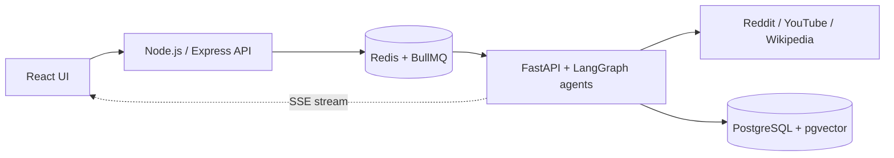

  

**Final-year B.E. student (2027 batch) · Open to Software Engineer, Backend and GenAI roles and internships**

---

## 👋 About

I build scalable full-stack applications and AI-powered systems, with a focus on backend architecture, distributed workflows and production-ready engineering.

- **Education:** B.E. Electronics & Computer Engineering, PICT Pune (CGPA 9.01/10)
- **Focus:** Full-stack development, backend systems, generative AI
- **Currently building:** Agentic AI, RAG and AI engineering projects
- **Portfolio:** [swayamkorde.online](https://swayamkorde.online) has all my work in one place

---

## 🚀 Featured Projects

### TrueThread

**An AI research system that ingests Reddit, YouTube and Wikipedia and scores claims for credibility, reaching 0.88 faithfulness on automated evaluation.**

Microservices backend with BullMQ job queues on Redis, parallel LangGraph agent workflows, RAG over PostgreSQL + pgvector, and real-time SSE streaming.

`React` `Node.js` `FastAPI` `PostgreSQL` `Redis` `LangGraph` `Docker`

---

### Insight News

**A news intelligence platform that has processed 1,300+ articles through a 4-stage Ingest → Scrape → Summarize → Bias pipeline.**

Aggregates RSS articles, runs automated fact-checking, and computes a weighted bias score (70% LLM, 20% lexical, 10% viewpoint). Deployed on AWS EC2 with ML inference on Hugging Face Spaces.

`React` `Node.js` `FastAPI` `MongoDB` `Hugging Face` `AWS EC2` `GitHub Actions`

---

### GradeX

**An academic management system that helps faculty flag at-risk students early from performance and attendance trends.**

Separate OLTP/OLAP workloads with a Star Schema data warehouse, role-based authentication and stream-based bulk CSV processing.

`Node.js` `Express` `MongoDB` `SQL` `Data Warehousing`

---

## 💼 Experience

**Freelance Web Developer**

Delivered a production-ready React + Tailwind CSS website for a coaching institute, owning the full client engagement: requirements, pricing, proposal, development, deployment and domain setup.

---

## 🛠️ Tech Stack

**Languages**
 

**Core CS**
 

**Web and Backend**
 

**AI / ML**
 

**Databases and Data**
 

**DevOps and Tools**
 

---

## 🏆 Achievements

- **Hackathon:** Top 10 among 350+ teams at SciTech Innovation Hackathon 2025 (national-level)
- **Competitive programming:** 2★ on CodeChef (max rating 1463), 350+ DSA problems solved across LeetCode and CodeChef
- **Leadership:** Department Captain, Table Tennis, leading team selection for inter-department tournaments

---

## 📊 GitHub Stats

---

## Contribution Graph

<picture>
  <source media="(prefers-color-scheme: dark)" srcset="https://raw.githubusercontent.com/sk200005/sk200005/output/github-contribution-grid-snake-dark.svg">
  <source media="(prefers-color-scheme: light)" srcset="https://raw.githubusercontent.com/sk200005/sk200005/output/github-contribution-grid-snake.svg">
  
</picture>

